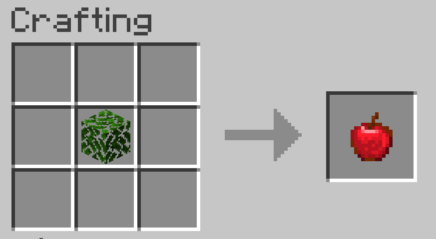
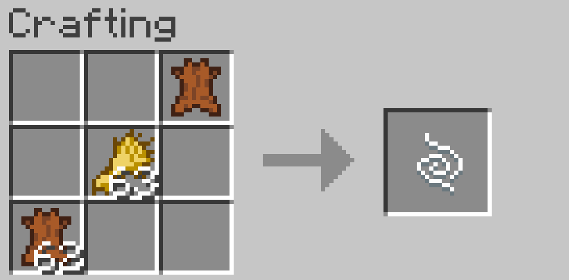

# Guide


## Instalation

Move the downloaded folder to your  datapacks folder inside of your world folder.
The folder is usually located in:
```
C:\Users\yourusername\AppData\Roaming\.minecraft\saves\yourworld\datapacks
```

## kickstart

One addition added in the Datapack, is a crafting recipe, that lets you craft oak leaves into apples.




### ***Change the time with functions***

***Change the time without cheating! Using functions.***

```
/function sf:day
```

You can also also change the time to night.

```
/function sf:night
```


# Documentation

The datapack adds a few, but minor changes.
Here is a documentation of all the features added.

## Functions


#### ***functions tree***

1. day
2. night
3. supplies
4. fly(doesnt work)
5. spawnables
    1. protectv
    2. farm
    3. trade
 6. particle
    
### Day

The day function sets the time to day if you type
```
/function sf:day
```
in the chat. The best thing about is, that you dont need to have cheats enabled to use the function.


### Night
This function simply sets the time to night
```
/function sf:night
```

### Supplies

When runned, it gives you one cooked beef.
```
/function sf:supplies
```

### Fly

This function is supposed to make you fly;
By constantly spawning a blok underneath you.
But it doesnt work.

```
/function sf:fly
```

## Spawnables

### Protectv

This function spawns Villagers and some golems.
```
/function sf:protectv
```

### Farm

This function lets you spawn a big amount of sheep, horses, cows and pigs.
It is recommended to call the function inside of a fenced area.

```
/function sf:farm
```

### Trade

This function lets you spawn a Villager and gives you a loom (I dont know why I added this).

```
/function sf:trade
```

### Particle

This is just a test function. Its part of the sfe (Simple Flask Extras)
 namespace. It just spawns a flame particle.
 
 ```
 /function sfe:particle
 ```
 
 ## Recipes
 
 1. apple recipe
 2. saddle recipe
 
 ### Apple recipe
 
 A apple can be crafted, by putting a oak leaves (NOT DARK OAK LEAVES!) into the crafting grid.
 example:
 
 
 ### Saddle recipe
 
 A saddle is crafted by putting oak plank in the middle crafting grid, than putting leather in the top, left, right crafting grids.
 Example:
 
 
 ### String recipe
 
 a string is crafted by using two leather and one wheat.  (only applies for version 0.1 and higher)
  


## Downloads

The official download is on Planetminecraft https://www.planetminecraft.com/data-pack/succes-failure-v0-0-1-functions/

